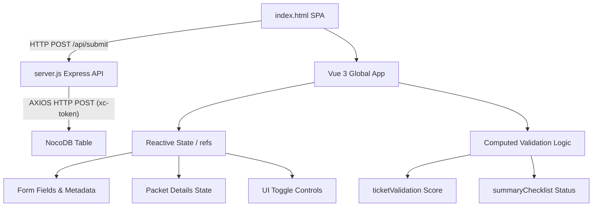

# System Patterns - TechNova SOC Analyst Simulator

## System Architecture

The application is built using a **Client-Server architecture** containerized via Docker. The client-side is a Single Page Application (SPA), and the server-side is a lightweight Express API.

## Component Relationships & Responsibilities

### 1. View Layout Components (Tailwind)
- **Top Header Bar**: Holds general status, the live verification score (`score` / `totalAnswerFields`), and toggle buttons (Mission Guide, Hints).
- **Scenario Card**: Establishes the narrative background of the security incident.
- **Evidence Portal (Tabs)**:
  - *Defender Alert Log*: Shows mock Windows Defender event details.
  - *Network PCAP*: Implements a table depicting a network traffic capture. Clicking any row populates the detailed packet inspector pane below it.
  - *Threat Intel*: Shows CVE metadata (CVE-2022-30190) from the National Vulnerability Database.
- **Incident Ticket Form**: Interactive inputs (text, select lists, textareas) that bind to Vue state.
- **Tier 2 Escalation Email Draft**: A highly styled `<textarea>` input enabling students to manually customize the escalation email body before copying or initiating escalation.
- **Success Modal**: Activates when the user scores 100% and hits "Escalate Incident". Renders the Tier 2 response output, achievement awards, database persistency statuses, and the print trigger.
- **Node.js Express Backend (`server.js`)**: Serves `index.html` statically on `/`, exposes `/api/submit` to process incoming student answers, and acts as a proxy forwarding submissions securely to NocoDB using backend-only environment variables.
- **Containerization (`Dockerfile`)**: Wraps both client and server inside a minimal `node:18-alpine` Docker container for easy orchestration and deployment.

### 2. State & Data Structure
- `studentEmail`: Writable ref representing the student's email address.
- `sessionSet`: Writable ref parsing and housing the `SessionSet` token from the client URL parameters (`?SessionSet=...`).
- `isEmailEdited`: Boolean ref tracking whether the student has manually modified the email draft.
- `customEmailBody`: Writable ref representing the current editable email text.
- `defaultEmailBody`: Computed ref housing the dynamic template compiled from ticket answers and metadata.
- `ticket`: Bindings for host details, threat details, and CVE references:
  - `hostname` (Expected: `'FIN-PC-04'`)
  - `internalIP` (Expected: `'192.168.10.45'`)
  - `department` (Expected: `'Finance'`)
  - `threatName` (Expected: `'Exploit:Win32/Follina.Aldha'`)
  - `fileName` (Expected: `'Q3_Overdue_Invoice.docx'`)
  - `externalIP` (Expected: `'203.0.113.88'`)
  - `attackerPort` (Expected: `'80'`)
  - `attackerProtocol` (Expected: `'TCP'`)
  - `secondaryFile` (Expected: `'update.exe'` or `'/payload/update.exe'`)
  - `cveId` (Expected: `'CVE-2022-30190'`)
  - `severity` (Expected: `'High'`)
  - `summary` (Free text block analyzed by key terms)
- `packets`: Array of 5 network packets modeling the handshake and payload download.

### 3. Business & Verification Logic
- **`ticketValidation`**: A computed object that maps each state property to a Boolean correctness value. Checks are strictly trim-sanitized and lowercased.
- **`summaryChecklist`**: Looks for four key phrases in the user summary (`finance`, `invoice`, `cve`, `payload`) to update the real-time checklist feedback.
- **`defaultEmailBody` watcher**: Automatically propagates newly generated template strings to `customEmailBody` *only* if the student has not yet edited the text manually (`!isEmailEdited`).
- **`resetEmailTemplate()`**: Instantly reverts any custom student revisions back to the dynamic template state, clearing the `isEmailEdited` flag.
- **`score`**: Multiplies `correctAnswersCount / totalAnswerFields` by 100 to yield a clean percentage.
- **Print Styles**: CSS `@media print` targets ensure that when `window.print()` is called, all background gradients, navigations, form elements, and sidebars are suppressed, leaving only a perfectly formatted high-contrast Certificate of Completion.
